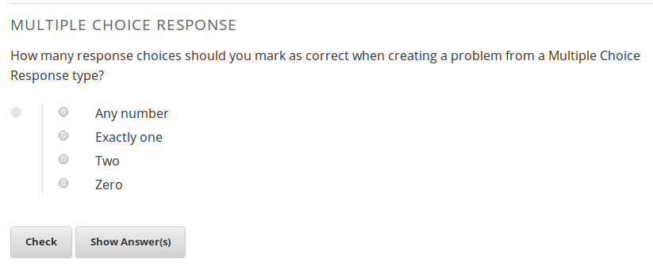

```{r echo=FALSE, warning=FALSE, results='hide', message=FALSE}
library(gridExtra)
library(RWeka)
library(tm)
library(lsa)

aspell_path<-"/usr/bin/aspell"

spell_correct<-function(x)
{
  x<-tolower(x)
  t<-tempfile()
  con<-file(t)
  writeLines(x,con)
  checked<-aspell(t,program=aspell_path,control=c("--sug-mode=ultra"))
  close(con)
  unlink(t)
  check_frame<-as.data.frame(checked)
  if(nrow(check_frame)>0)
  {
    for(i in 1:nrow(check_frame))
    {
      temp<-try(gsub(paste("\\b",check_frame[i,1],"\\b",sep=""),check_frame[i,5][[1]][1],x))
      if(class(temp)!="try-error")
        x<-temp
    }
  }
  x
}

prompt = "Why do you want to learn about machine learning?"
training_text = c("I like solving interesting problems.", "What is machine learning?", "I'm not sure.", "Machien lerning predicts eveyrthing.")
training_scores = c(2,0,1,0)
train_length = length(training_scores)
train_frame = data.frame(text=training_text, score=training_scores)
```

## What is edX?

* edX (edx.org) is an educational non-profit created by founding partners Harvard and MIT in May of 2012.  
* Several other universities have since joined the effort.
* Two major components:
  * edX platform learning management system (LMS)
  * edX studio content management system (CMS)
  * Together, enable authoring and delivery of courses at extremely large scale.
* Have hosted 30+ courses in subject areas from physics to justice, with a larger number upcoming.
* Recenly passed the 1 million student mark.

--- .class #id 

## Assessments on the edX platform

* When edX launched, assessments were restricted to "closed-choice" response.
* 
* 

--- .class #id

## How do we support humanities courses?

* Difficult to support humanities courses without allowing students to enter free-text responses.
  * Richer assessments allow for varied instructional and learning styles.
* Short answer responses also useful for STEM courses offered by edX.

--- .class #id

## Potential strategies

* Peer assessment (students grade each other)
* Self assessment (students grade themselves)
* Instructor assessment (instructor grades everyone)
* AI Assessment (computer algorithm is trained and then grades students)
* Scoring students based on participation and quality of discussions.

--- .class #id

## Overall Implementation

* Through edx-ora (https://github.com/edx/edx-ora), implement a combination of peer assessment, self assessment, instructor assessment, and AI assessment.
* edx-ora is currently being used to grade student free-text responses on the edX platform.
* In alpha, and development is ongoing.
* Although the focus of this talk is AI assessment, highly encourage looking at edX-ora if you are interested.

--- .class #id

## How it looks

* 

--- .class #id

## What is AI assessment, anyways?

* AI assessment is the edX term for a more generic process: machine-learning based text classification and scoring.
* We can start with any "training set" of text and associated scores.
  * ie Reddit posts and scores, essays and scores, books and the names of the authors who wrote them.
* The goal is to "train" a model that can map future input text to a score/category without being told what it is (prediction)

--- .class #id

## Training set example

Let's say that I wanted to give a survey after the talks today and ask the following question:

`r prompt`

The responses might look like this:

```{r echo=FALSE}
cat(paste(c(1:train_length), training_text, collapse="\n"))
```

Let's say that the survey also asks people to rate the talks on a scale of `r min(training_scores)` to `r max(training_scores)`.

We would now have text and associated scores:

```{r echo=FALSE, fig.width=5, fig.height=1}
grid.table(train_frame)
```

--- .class #id

## First steps

* Computers can't directly understand text like humans can.
  * Humans automatically break down sentences into units of meaning.
* In this case, we have to first explicitly show the computer how to do this, in a process called tokenization.
* After tokenization, we can convert the tokens into a matrix (bag of words model).
* Once we have a matrix, we can use machine learning to train a model and predict scores.

--- .class #id

## Tokenization

Let's tokenize the first survey response:

```{r echo=FALSE}
tokenizer<-function(x) RWeka::NGramTokenizer(x, Weka_control(min = 1, max = 1))
tokenizer(training_text[1])
```

In this very simple case, we have just made each word a token (similar to *string.split(' ')*).

--- .class #id

## Bag of words model

* The bag of words model is a common way to represent documents in matrix form.
* We construct an *nxt* document-term matrix, where *n* is the number of documents, and *t* is the number of unique terms.
* Each column represents a unique term, and each cell *i,j*  represents how many of term *j* are in document *i*.

```{r echo=FALSE, fig.width=10, fig.height=1}
corpus = Corpus(VectorSource(training_text))
train_mat = as.matrix(DocumentTermMatrix(corpus,control=list(tokenize=tokenizer,removePunctuation=TRUE,stopwords=FALSE,removeNumbers=FALSE, tolower=FALSE)))
grid.table(train_mat)
```

--- .class #id

## Bag of words overview

* Ordering of words within a document is not taken into account in the basic bag of words model.
* Once we have our document-term matrix, we can use machine learning techniques.
* I have outlined a very simple framework, but it can easily be built on and extended.

--- .class #id

## Minimizing distances between vectors

* We want to minimize the distance between two similar feature vectors.
  * For example, the below text fragments are substantially similar:
    * Bill wanted to grow up and be a Doctor.
    * bill wnted to gorw up and a be a doctor!
  * However, the simple tokenization we outlined above will not catch this.
* Spell correction using aspell or [Peter Norvig's method](http://norvig.com/spell-correct.html).
* Lowercase input strings.
* We minimize distance because we want the same response to get the same score.

--- .class #id

## Preserving information

* It is important to preserve as much of the input information as we can.
* When we start to spell correct or lowercase strings, we lose information.
  * We may be lowercasing the proper name Bill to the word bill.
  * If we are scoring an essay, and spelling is an important criteria, we don't want to lose that.

Old features:

```{r echo=FALSE, fig.width=10, fig.height=1.5}
new_text = lapply(training_text, function(x) spell_correct(tolower(x)))
new_corpus = Corpus(VectorSource(new_text))
new_mat = as.matrix(DocumentTermMatrix(new_corpus,control=list(tokenize=tokenizer,removePunctuation=TRUE,stopwords=FALSE,removeNumbers=FALSE)))
grid.table(train_mat)
```
New features with lowercasing and spell correction:

```{r echo=FALSE, fig.width=10, fig.height=1.5}
grid.table(new_mat)
```

--- .class #id

## Orthogonality

* As we saw in the slide before, we want to generate as much new information as possible while preserving existing information.
* This will have us generate multiple *feature sets*.
  * Recommend having one feature set with original input text.
* Can measure orthoganality by taking vector distance or vector similarity between each document vector.
  * Need to reformat document vectors to contain all terms.

Cosine similarities:
```{r echo=FALSE}
redo_names = function(orig_mat, nmat) {
  combined_names = sort(unique(c(colnames(orig_mat), colnames(nmat))))
  for(n in combined_names) {
    if(!n %in% colnames(orig_mat)) {
      orig_mat = cbind(orig_mat, rep(0,nrow(orig_mat)))
      colnames(orig_mat)[ncol(orig_mat)] = n
    }
  }
  orig_mat = orig_mat[,combined_names]
  orig_mat
}

full_train_mat = redo_names(train_mat,new_mat)
full_new_mat = redo_names(new_mat, train_mat)
sim = as.numeric(lapply(1:nrow(full_train_mat), function(x) cosine(full_train_mat[x,], full_new_mat[x,])))
sim
```

Mean similarity:
```{r echo=FALSE}
mean(sim)
```


