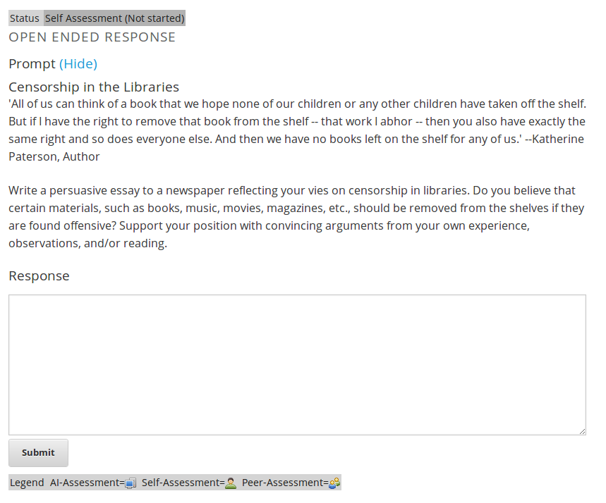

## Before we start

* Follow along at vikparuchuri.github.io/boston-python-ml
* Get the source at github.com/vikparuchuri/boston-python-ml

# Who am I?
* Machine learning consultant at edX
* vik.paruchuri@gmail.com
* [LinkedIn](linkedin.com/in/vikparuchuri)

--- .class #id 

## What is edX?

* edX (edx.org) is an educational non-profit created by founding partners Harvard and MIT in May of 2012.  
* Several other universities have since joined the effort.
* Two major components:
  * edX platform learning management system (LMS)
  * edX studio content management system (CMS)
  * Together, enable authoring and delivery of courses at extremely large scale.
* Have hosted 30+ courses in subject areas from physics to justice, with a larger number upcoming.
* Recenly passed the 1 million student mark.

--- .class #id 

## Assessments on the edX platform

* When edX launched, assessments were restricted to "closed-choice" response.
* 
* 

--- .class #id

## How do we support humanities courses?

* Difficult to support humanities courses without allowing students to enter free-text responses.
  * Richer assessments allow for varied instructional and learning styles.
* Short answer responses also useful for STEM courses offered by edX.

--- .class #id

## Potential strategies

* Peer assessment (students grade each other)
* Self assessment (students grade themselves)
* Instructor assessment (instructor grades everyone)
* AI Assessment (computer algorithm is trained and then grades students)
* Scoring students based on participation and quality of discussions.

--- .class #id

## Overall Implementation

* Through edx-ora (https://github.com/edx/edx-ora), implement a combination of peer assessment, self assessment, instructor assessment, and AI assessment.
* edx-ora is currently being used to grade student free-text responses on the edX platform.
* In alpha, and development is ongoing.
* Although the focus of this talk is AI assessment, highly encourage looking at edX-ora if you are interested.

--- .class #id

## How it looks

* 

--- .class #id

## What is AI assessment, anyways?

* AI assessment is the edX term for a more generic process: machine-learning based text classification and scoring.
* We can start with any "training set" of text and associated scores.
  * ie Reddit posts and scores, essays and scores, books and the names of the authors who wrote them.
* The goal is to "train" a model that can map future input text to a score/category without being told what it is (prediction)

--- .class #id

## Training set example

Let's say that I wanted to give a survey after the talks today and ask the following question:

Why do you want to learn about machine learning?

The responses might look like this:


```
## 1 I like solving interesting problems.
## 2 What is machine learning?
## 3 I'm not sure.
## 4 Machien lerning predicts eveyrthing.
```


Let's say that the survey also asks people to rate the talks on a scale of 0 to 2.

We would now have text and associated scores:

 


--- .class #id

## First steps

* Computers can't directly understand text like humans can.
  * Humans automatically break down sentences into units of meaning.
* In this case, we have to first explicitly show the computer how to do this, in a process called tokenization.
* After tokenization, we can convert the tokens into a matrix (bag of words model).
* Once we have a matrix, we can use machine learning to train a model and predict scores.

--- .class #id

## Tokenization

Let's tokenize the first survey response:


```
## [1] "I"           "like"        "solving"     "interesting" "problems"
```


In this very simple case, we have just made each word a token (similar to *string.split(' ')*).

--- .class #id

## Bag of words model

* The bag of words model is a common way to represent documents in matrix form.
* We construct an *nxt* document-term matrix, where *n* is the number of documents, and *t* is the number of unique terms.
* Each column represents a unique term, and each cell *i,j*  represents how many of term *j* are in document *i*.

 


--- .class #id

## Bag of words overview

* Ordering of words within a document is not taken into account in the basic bag of words model.
* Once we have our document-term matrix, we can use machine learning techniques.
* I have outlined a very simple framework, but it can easily be built on and extended.

--- .class #id

## Minimizing distances between vectors

* We want to minimize the distance between two similar feature vectors.
  * For example, the below text fragments are substantially similar:
    * Bill wanted to grow up and be a Doctor.
    * bill wnted to gorw up and a be a doctor!
  * However, the simple tokenization we outlined above will not catch this.
* Spell correction using aspell or [Peter Norvig's method](http://norvig.com/spell-correct.html).
* Lowercase input strings.
* We minimize distance because we want the same response to get the same score.

--- .class #id

## Preserving information

* It is important to preserve as much of the input information as we can.
* When we start to spell correct or lowercase strings, we lose information.
  * We may be lowercasing the proper name Bill to the word bill.
  * If we are scoring an essay, and spelling is an important criteria, we don't want to lose that.

Old features:

 

New features with lowercasing and spell correction:

 


--- .class #id

## Orthogonality

* As we saw in the slide before, we want to generate as much new information as possible while preserving existing information.
* This will have us generate multiple *feature sets*.
  * Recommend having one feature set with original input text.
* Can measure orthogonality by taking vector distance or vector similarity between each document vector.
  * Need to reformat document vectors to contain all terms.

Cosine similarities:

```
## [1] 1.0000 0.6667 1.0000 0.2500
```


Mean similarity:

```
## [1] 0.7292
```


--- .class #id

## Meta-features

* We may also wish to extract higher-level features, such as number of spelling errors, number of grammar errors, etc.
* Can add meta-features to the bag of words matrix.
* Meta-features preserve information.
  * Can also extract and condense information.

--- .class #id

## Which features are the right features?

* Two simple ways
  * Create a machine learning model and measure error
  * Do a chi-squared test or a fisher test of significance.
* The tests essentially say "Is feature x significantly different between low and high scoring texts"?

 


--- .class #id

## Finally, some machine learning!

* Now that we have generated our bag of words features and our meta-features, and figured out which ones are good, we can move onto machine learning.
* The goal is to "train" a model that can predict future scores and categories.
* Two broad categories of algorithms: classification and regression (not linear regression!)
  * Most regression assumes that you are on a continuous scale.
  * Classification is discrete.
  * Classification works best if you have less than 5 "score points" (we have 3).
  * Should try both, and measure error.
* We also have a lot of choice regarding the algorithm to use.
  * Random forest
  * Gradient boosted trees
  * Linear regression

--- .class #id

## Linear regression

* A simple linear equation is $y=m*x+b$ , where y is the target value(score), m is a coefficient, and b is a constant.
* In linear regression, we would do something like $y=m&#95;{1}*x&#95;{1}+m&#95;{2}*x&#95;{2}+\dots+m&#95;{n}*x&#95;{n}+b$.
  * Each column in the matrix (feature) has a coefficient.
  * When we train the model, we calculate the coefficients.
  * Once we have the coefficients, we can predict how future text would score.

Coefficients:

```
##              (Intercept) eveyrthing interesting learning
## coefficients           1         -1           1       -1
```


Words that are not shown do not have a coefficient (ie they did not have any useful information for scoring).

--- .class #id

## Predicting scores

* Now that we have our coefficients, and our intercept term, we can construct our equation and predict scores for new text.
* Any new text has to go through the exact same process that we passed our training text through.
  * In this case, text will go through the bag of words model.  We will skip additional processing to keep it simple.

Let's use this as our "test" text that we will predict a score for:

```
## 1 I want to learn to solve interesting problems.
```


 


* Note that we have used the exact same features as in the training matrix. 
  * Without this, our model will not work.

--- .class #id

## Predicting scores

* We can use our new features to predict a score for our test text.


* Our prediction is 2
* We derive this by multiplying each column in the matrix by its associated coefficient, then adding those together and adding the intercept.
* In this case, the intercept was 1 and the presence of the word *interesting* added another 1.

--- .class #id

## Evaluating model accuracy


* A very important question when creating a model and exploring various feature combinations is accuracy.
* In order to measure accuracy, we use a principle called cross-validation.
  * Split training data set into n parts randomly (each part is a "fold", and we call it n-fold cross validation).
  * Iterate from 1 to n and predict the scores of parts[n] from all the data in parts[!n].
* Let's keep it simple, and split into 2 parts non-randomly.
  * We will make a model using only the first 2 training matrix rows, and then another model using the next 2.
  * Each model will be used to predict the scores of the texts that did not go into the model.
* Why do we do this?
  * Measuring accuracy allow us to figure out optimal combinations of strategies.
  * Cross validation gives us an unbiased accuracy estimate.

--- .class #id

## Evaluating model accuracy

First fold:

 


Second fold:
 


Predictions:
 


* Predictions are not very accurate due to very limited data.

--- .class #id

## Quantify error

* Quantify accuracy through one of several methods
  * Kappa correlation
  * Mean absolute error
  * Root mean squared error
  * All of them turn error into a single number
* Important to set random seeds when doing most machine learning methods in order to make error meaningful from run to run.
* Root mean squared error
$RMSE=\\sqrt{\\frac{1}n\\sum\\limits&#95;{i=1}&#94;n(\\hat{Y&#95;{i}}-Y&#95;{i})&#94;2}$


