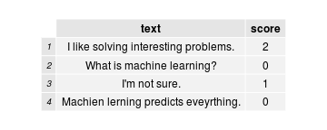
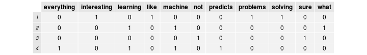

## Before we start

* Follow along at vikparuchuri.github.io/boston-python-ml
* Get the source at github.com/vikparuchuri/boston-python-ml

# Who am I?
* Machine learning consultant at edX
* vik.paruchuri@gmail.com
* [LinkedIn](linkedin.com/in/vikparuchuri)

--- .class #id 

## What is edX?

* edX (edx.org) is an educational non-profit created in May 2012.
* Two major components:
  * edX platform learning management system (LMS)
  * edX studio content management system (CMS)
  * Together, enable authoring and delivery of courses at extremely large scale.
* Have hosted 30+ courses in subject areas from physics to justice, with a larger number upcoming.
* Recenly passed the 1 million student mark.
* Platform and all software today [open source](github.com/edx) and coded in Python.
* Currently hiring (edx.org/jobs)

--- .class #id 

## Assessments on the edX platform

* When edX launched, assessments were restricted to "closed-choice" response.
* 
* 

--- .class #id

## How do we support humanities courses?

* Need support for free-text responses.
  * Richer assessments allow for varied instructional and learning styles.
* Short answer responses also useful for STEM courses.
* One way to do this is through AI Assessment.

--- .class #id

## AI Assessment

* We can start with any "training set" of text and associated scores.
  * ie Reddit posts and scores, essays and scores, books and the names of the authors who wrote them.
* We "train" a model that can map future input text to a score/category without being told what it is (prediction)

--- .class #id

## Training set example

Let's say that I wanted to give a survey after the talks today and ask the following question:

Why do you want to learn about machine learning?

The responses might look like this:


```
## 1 I like solving interesting problems.
## 2 What is machine learning?
## 3 I'm not sure.
## 4 Machien lerning predicts eveyrthing.
```


If I also asked people to rate the talks on a scale of 0 to 2, we would now have text and associated scores:

 


--- .class #id

## First steps

* Computers can't directly understand text like humans can.
  * Humans automatically break down sentences into units of meaning.
* Have to first explicitly show the computer how to do it (tokenization)
* After tokenization, we can convert the tokens into a matrix (bag of words model).
* With the matrix, we can use a machine learning algorithm to train a model and predict scores.

--- .class #id

## Tokenization

Let's tokenize the first survey response:


```
## [1] "I"           "like"        "solving"     "interesting" "problems"
```


Each word is now a token (similar to *string.split(' ')*).

Can also extract sequences of words (n-grams).  This allows the bag of words model to have some information about word ordering.

--- .class #id

## Bag of words model

* The bag of words model is a common way to represent documents in matrix form.
* Construct an *nxt* document-term matrix, where *n* is the number of documents, and *t* is the number of unique terms.
* Each column represents a unique term, and each cell *i,j*  represents how many of term *j* are in document *i*.
  * We are using term frequency.  Could also use tf-idf.

 


--- .class #id

## Minimizing distances between vectors

* The below text fragments are substantially similar:
  * Bill wanted to grow up and be a Doctor.
  * bill wnted to gorw up and a be a doctor!
* However, the simple tokenization we outlined above will not catch this.
* Spell correction using aspell or [Peter Norvig's method](http://norvig.com/spell-correct.html).
* Minimize distance because we want the same response to get the same score from our algorithm.

--- .class #id

## Preserving information

* When we start to spell correct or lowercase strings, we lose information.
  * We may be lowercasing the proper name Bill to the word bill.
  * If we are scoring an essay, and spelling is an important criteria, we don't want to lose that.

Old features:

 

New features with lowercasing and spell correction:

 


--- .class #id

## Meta-features

* Number of spelling errors, number of grammar errors, etc.
* Preserve information.
  * If we are lowercasing everything, a "number of spelling errors" feature will capture some of the original information.
* Condense and extract information.
  * Several columns with capitalized words will contain a lot of word-specific information (including whether or not the word is capitalized), but making a feature "number of capitalizations" will condense all of that information.
  * If one of the criteria for whether or not an essay is good is whether or not the student has a synonym for "sun", a meta-feature could extract all possible synonyms and condense them into a count.

--- .class #id

## Which features are the right features?

* Two simple ways
  * Create a machine learning model and measure error.
  * Do a chi-squared test or a fisher test of significance.
* "Is feature x significantly different between low and high scoring texts"?
* The lower the p-value, the more significant the difference is.

 


--- .class #id

## Finally, some machine learning!

* Two broad categories of algorithms: classification and regression (not linear regression!)
  * Most regression assumes that you are on a continuous scale.
  * Classification is discrete.
  * Classification works best if you have less than 5 "score points" (we have 3).
  * Should try both, and measure error.
* We also have a lot of choice regarding the algorithm to use.
  * In this case, use linear regression

--- .class #id

## Linear regression

* A simple linear equation is $y=m*x+b$ , where y is the target value(score), m is a coefficient, and b is a constant.
* In linear regression, we would do something like $y=m&#95;{1}*x&#95;{1}+m&#95;{2}*x&#95;{2}+\dots+m&#95;{n}*x&#95;{n}+b$.
  * Each column in the matrix (feature) has a coefficient.
  * Predict scores using coefficients.

Coefficients:

```
##              (Intercept) eveyrthing interesting learning
## coefficients           1         -1           1       -1
```


--- .class #id

## Predicting scores

* Any new text that we want to predict the score for has to go through the exact same process that we passed our training text through.

Let's use this as our "test" text that we will predict a score for:

```
## 1 I want to learn to solve interesting problems.
```


 


* We can use our new features to predict a score for our test text.


Our prediction is 2. In this case, the intercept was 1 and the presence of the word *interesting* added another 1.

--- .class #id

## Evaluating model accuracy


* In order to measure accuracy, we use a principle called cross-validation.
  * Split training data set into n parts randomly (each part is a "fold", and we call it n-fold cross validation).
  * Iterate from 1 to n and predict the scores of parts[n] from all the data in parts[!n].
* We will split into 2 parts non-randomly.
  * Make a model using only the first 2 training matrix rows, and then another model using the next 2.
  * Each model will be used to predict the scores of the texts that did not go into the model.
* Why do we do this?
  * Measuring accuracy allow us to figure out optimal combinations of strategies.
  * Unbiased accuracy estimate.

--- .class #id

## Evaluating model accuracy

First fold:

 


Second fold:
 


Predictions:
 


--- .class #id

## Quantify error

* Kappa correlation
* Mean absolute error
* Root mean squared error
* $RMSE=\\sqrt{\\frac{1}n\\sum\\limits&#95;{i=1}&#94;n(\\hat{Y&#95;{i}}-Y&#95;{i})&#94;2}$
* Our RMSE is 0.9354

--- .class #id

## EASE

* EASE exposes high level functions for creating models and grading students.
* Full test suite (>80% coverage) to easily evaluate changes.
* Under continuous development, and easy to contribute to.
  * Available through pip, but recommend cloning the master branch from github and following the install instructions.
* Feel free to fork and pull request.
* See code.edx.org for information.

--- .class #id

## Discern

* Discern is an API wrapper for EASE.
  * Found at github.com/edx/discern
  * Exposes a REST Web API for text and problems that allows for scoring.
  * Has over 80% test coverage.
* Discern allows for you to write code without worrying about implementation details.
* Also has useful tools for learning:
  * Can store information about peer, self, and instructor assessment
  * Reports the "confidence level" it has in a certain score that it predicts
  * Allows for sharing of problems
* See code.edx.org for information.

--- .class #id

## Hosted Discern

* Hosted version of discern at discern.edx.org .
* Currently in alpha.  Development is still ongoing.
* Questions should be asked on the [mailing list for discern](https://groups.google.com/forum/#!forum/edx-discern).

--- .class #id

## Basic connection

```
import requests
#This queries the top level schema and gets all of the available models, and their associated endpoints.
response = requests.get("http://discern.edx.org/essay_site/api/v1/?format=json")

#Decode the json serialized response into a python object.
rj = response.json()

#Loop through the json object and print out the data.
for model in rj:
    print("Model: {0} Endpoint: {1} Schema: {2}".format(model, rj[model]['list_endpoint'], rj[model]['schema']))

#Now, let's try to get the schema for a single model.
response = requests.get("http://discern.edx.org/" + rj['essay']['schema'] + "?format=json")
```

--- .class #id

## Using the example application with discern

* Find example application [here](https://github.com/edx/discern/tree/master/examples/problem_grader).
* Deploy the example with cloudformation/ansible [here](https://github.com/VikParuchuri/grader-deployment).  
  * Example on how to deploy something similar [here](http://vikparuchuri.com/blog/creating-a-wordpress-single-or-multisite-install-using-cloudformation-and-ansible/).
* Hosted version at grader.vikparuchuri.com that may or may not be running.

--- .class #id

## Add course


--- .class #id

## Show problems


--- .class #id

## Add essay


--- .class #id

## Grade essay


--- .class #id

## View grades


--- .class #id

## Questions?


